---
hide:
  - navigation
  - toc
---

# Articles

??? example "["How to Stand Out on Github with Profile READMEs"](https://medium.com/better-programming/how-to-stand-out-on-github-with-profile-readmes-dfd2102a3490?source=friends_link&sk=61df9c4b63b329ad95528b8d7c00061f)  *Jessica Lim*"
    <a href="https://medium.com/better-programming/how-to-stand-out-on-github-with-profile-readmes-dfd2102a3490?source=friends_link&sk=61df9c4b63b329ad95528b8d7c00061f">
    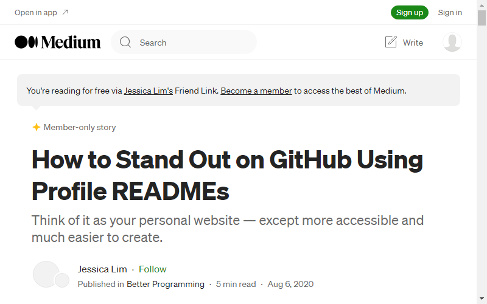
    </a>

??? example "["What's on your GitHub Profile"](https://dev.to/waylonwalker/what-s-on-your-github-profile-40p3)  *Waylon Walker*"
    

??? example "["3 Ways to Spice up your Github Profile README 🔥"](https://dev.to/jayehernandez/3-ways-to-spice-up-your-github-profile-readme-1276)  *Jaye Hernandez*"
    

??? example "["Dynamically Generated Github Stats For Your Profile ReadMe"](https://dev.to/anuraghazra/dynamically-generated-github-stats-for-your-profile-readme-o4g)  *Anurag Hazra*"
    <a href="https://dev.to/anuraghazra/dynamically-generated-github-stats-for-your-profile-readme-o4g">
    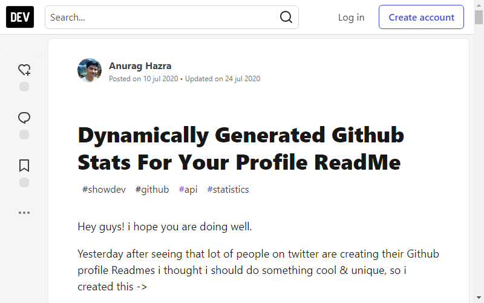
    </a>

??? example "["How to create an awesome GIF for your GitHub Profile README"](https://dev.to/satvikchachra/how-to-add-an-awesome-readme-to-your-github-profile-361n)  *Satvik Chachra*"
    <a href="https://dev.to/satvikchachra/how-to-add-an-awesome-readme-to-your-github-profile-361n">
    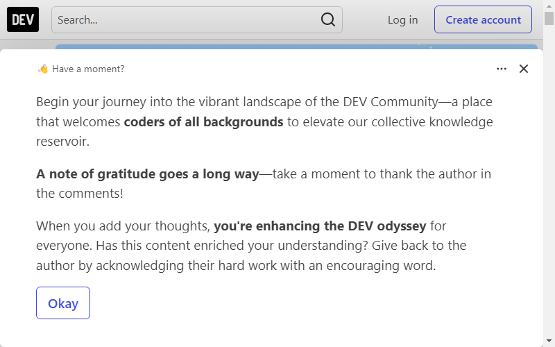
    </a>

??? example "["Create a special repository in your GitHub Profile 🔨, supported and unsupported features"](https://torrocus.com/blog/special-github-repository/)  *Alex Malaszkiewicz*"
    

??? example "["How to create a Github Profile README with Dynamic Github Stats"](https://codewithghazi.com/how-to-create-a-github-profile-readme-with-dynamic-github-stats/)  *Ghazi Khan*"
    <a href="https://codewithghazi.com/how-to-create-a-github-profile-readme-with-dynamic-github-stats/">
    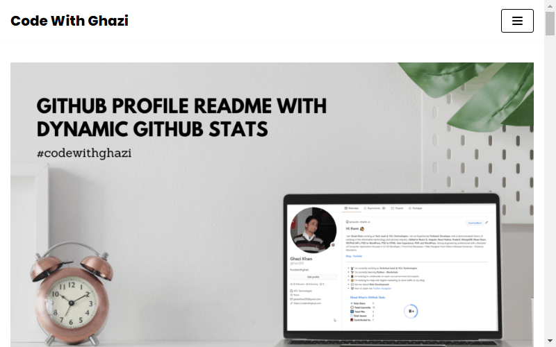
    </a>

??? example "["How I Built A Self-Updating README On My Github Profile"](https://www.mokkapps.de/blog/how-i-built-a-self-updating-readme-on-my-git-hub-profile/)  *Michael Hoffmann (Mokkapps)*"
    <a href="https://www.mokkapps.de/blog/how-i-built-a-self-updating-readme-on-my-git-hub-profile/">
    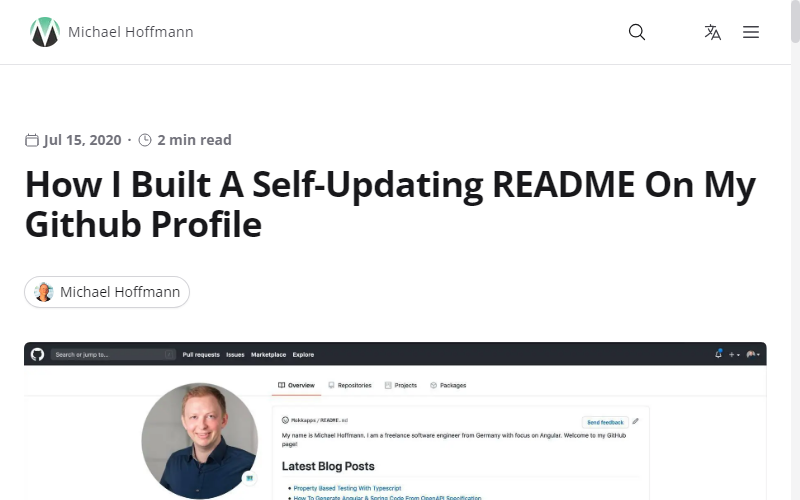
    </a>

??? example "["Building a self-updating profile README for GitHub"](https://simonwillison.net/2020/Jul/10/self-updating-profile-readme/)  *Simon Willison*"
    <a href="https://simonwillison.net/2020/Jul/10/self-updating-profile-readme/">
    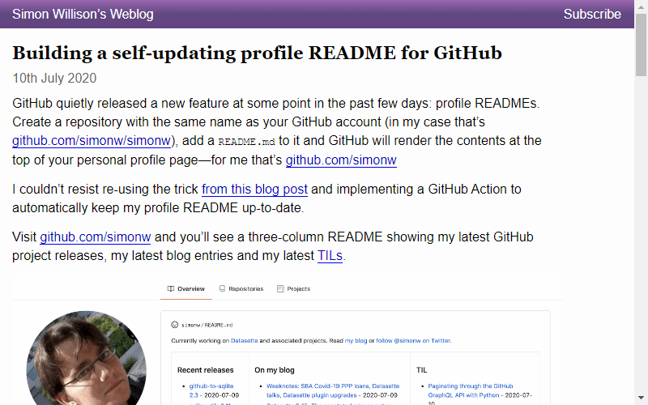
    </a>

??? example "["How to create an interactive README for your GitHub profile"](https://kavishhukmani.me/github-profile-interactive-readme-tutorial/)  *Kavish Hukmani*"
    <a href="https://kavishhukmani.me/github-profile-interactive-readme-tutorial/">
    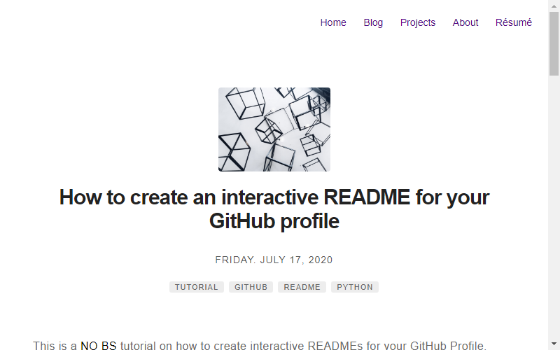
    </a>

??? example "["什么？Github 居然可以这么玩？"](https://zhuanlan.zhihu.com/p/161705999)  *Tw93*"
    <a href="https://zhuanlan.zhihu.com/p/161705999">
    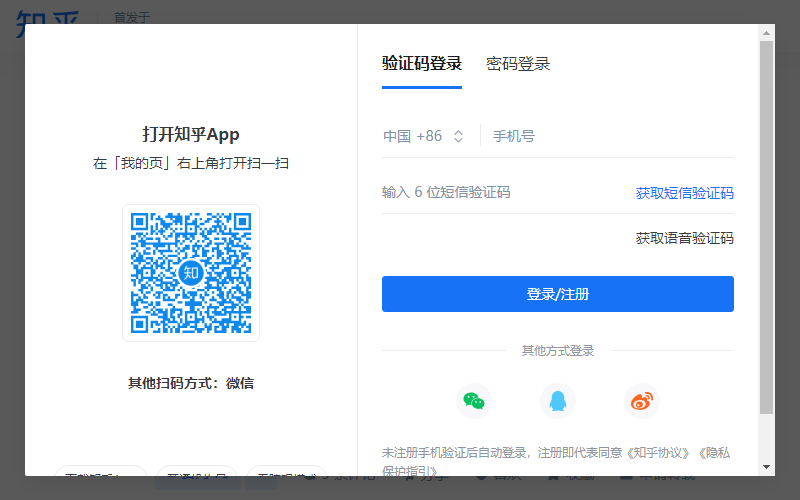
    </a>

??? example "["Getting started with Markdown Badges"](https://dev.to/ileriayo/mardown-badges-2og0)  *Ileriayo Adebiyi*"
    <a href="https://dev.to/ileriayo/mardown-badges-2og0">
    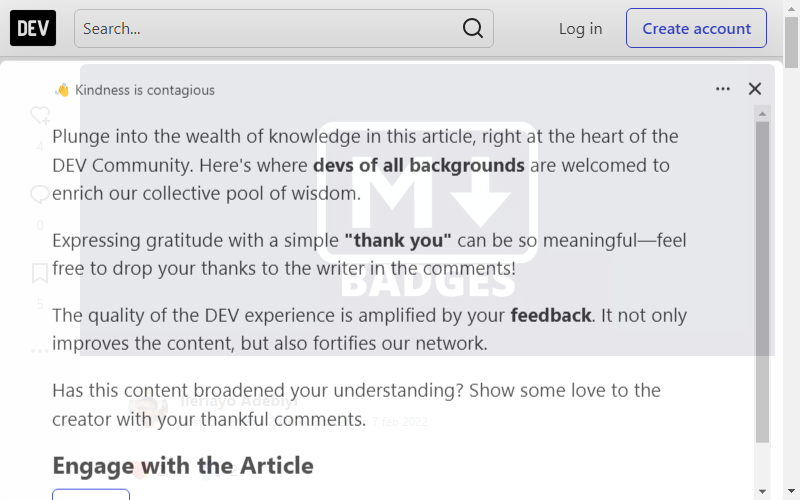
    </a>

??? example "["Show your latest dev.to posts automatically on your GitHub profile readme"](https://dev.to/gautamkrishnar/show-your-latest-dev-to-posts-automatically-in-your-github-profile-readme-3nk8)  *Gautam krishna R*"
    <a href="https://dev.to/gautamkrishnar/show-your-latest-dev-to-posts-automatically-in-your-github-profile-readme-3nk8">
    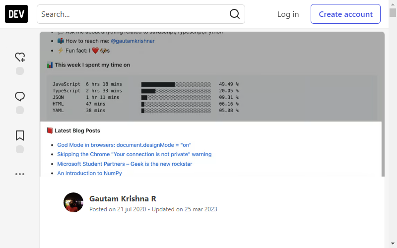
    </a>

??? example "["How I Built A Self-Updating README by Webhooks and Netlify Functions"](https://github.com/RaoHai/RaoHai/blob/master/How-I-Built-A-Self-Updating-README-by-Webhooks-and-Netlify-Functions.md/)  *Rao Hai*"
    <a href="https://github.com/RaoHai/RaoHai/blob/master/How-I-Built-A-Self-Updating-README-by-Webhooks-and-Netlify-Functions.md/">
    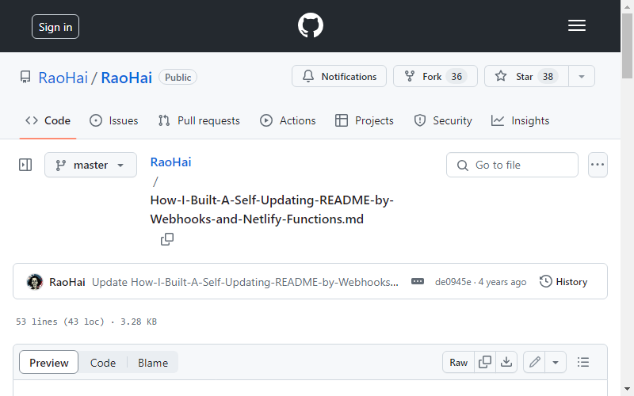
    </a>

??? example "["Build a Stunning README For Your GitHub Profile"](https://towardsdatascience.com/build-a-stunning-readme-for-your-github-profile-9b80434fe5d7)  *Martin Heinz*"
    <a href="https://towardsdatascience.com/build-a-stunning-readme-for-your-github-profile-9b80434fe5d7">
    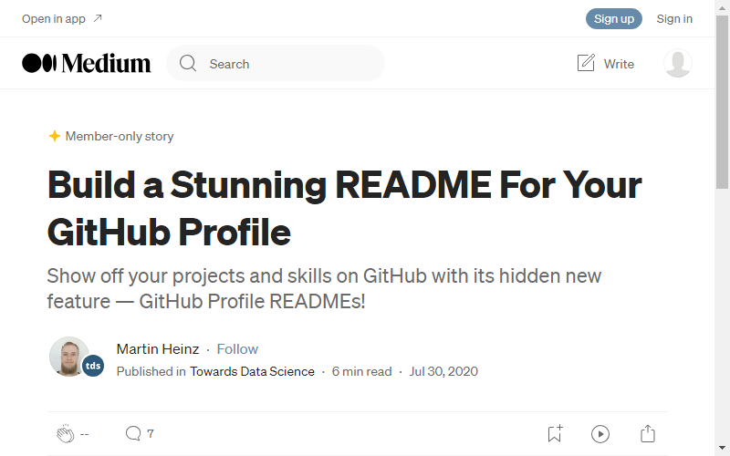
    </a>

??? example "["How I added my Spotify statistics to my GitHub readme 📜"](https://dev.to/gargakshit/how-i-added-my-spotify-statistics-to-my-github-readme-4jdd)  *Akshit Garg*"
    <a href="https://dev.to/gargakshit/how-i-added-my-spotify-statistics-to-my-github-readme-4jdd">
    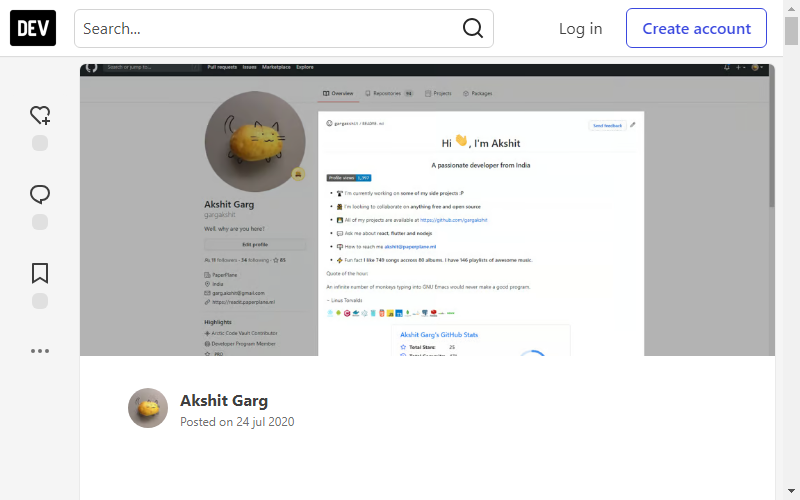
    </a>

??? example "["Static Readme Regeneration"](https://dev.to/aralroca/static-readme-regeneration-4pf2)  *Aral Roca*"
    <a href="https://dev.to/aralroca/static-readme-regeneration-4pf2">
    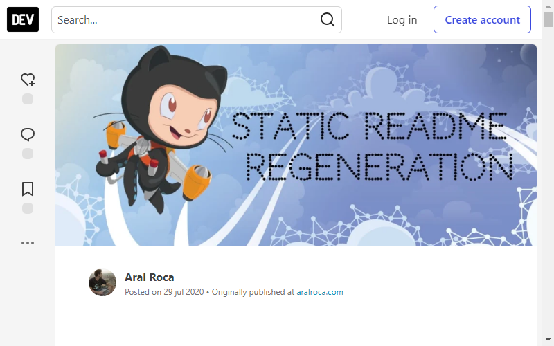
    </a>

??? example "["How to Create a Self-Updating README.md for Your GitHub Profile"](https://medium.com/@th.guibert/how-to-create-a-self-updating-readme-md-for-your-github-profile-f8b05744ca91)  *Thomas Guibert*"
    <a href="https://medium.com/@th.guibert/how-to-create-a-self-updating-readme-md-for-your-github-profile-f8b05744ca91">
    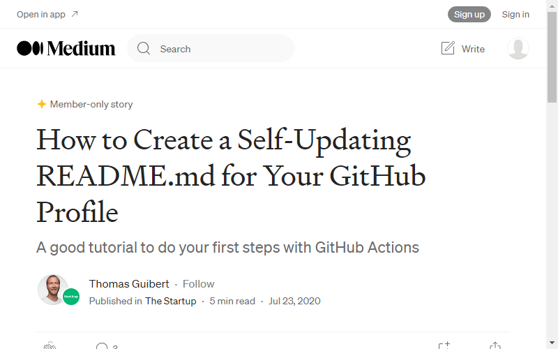
    </a>

??? example "["一文玩转github主页"](https://blog.holic-x.com/wv-blog/post/7ad96a5d.html)  *holic-x*"
    
