---
hide:
  - navigation
---

# Categories

## GitHub Actions 🤖

??? example "[Thomas Guibert](https://github.com/thmsgbrt/thmsgbrt#readme) "
    

??? example "[Brian Douglas](https://github.com/bdougie/bdougie#readme) "
    

??? example "[Shawn Wang](https://github.com/sw-yx/sw-yx#readme) "
    

??? example "[Simon Willison](https://github.com/simonw/simonw#readme) "
    

??? example "[Mike Coutermarsh](https://github.com/mscoutermarsh/mscoutermarsh#readme) "
    

??? example "[Michael Hoffmann (Mokkapps)](https://github.com/mokkapps/mokkapps#readme) "
    

??? example "[Athul Cyriac Ajay](https://github.com/athul/athul#readme) "
    

??? example "[Gautam Krishna R](https://github.com/gautamkrishnar/gautamkrishnar#readme) "
    

??? example "[Roald Nefs](https://github.com/roaldnefs/roaldnefs#readme) "
    

??? example "[Leo](https://github.com/mopig/mopig#readme) "
    

??? example "[Dhruv Jain](https://github.com/maddhruv/maddhruv#readme) "
    

??? example "[Erwin Lejeune](https://github.com/guilyx/guilyx#readme) "
    

??? example "[Jessica Lim](https://github.com/JessicaLim8/JessicaLim8#readme) "
    

??? example "[侑夕-Tw93](https://github.com/tw93/tw93#readme) "
    

??? example "[liununu](https://github.com/liununu/liununu#readme) "
    

??? example "[Filippo Rossi (qu4k)](https://github.com/qu4k/qu4k#readme) "
    

??? example "[Moe Poi ~](https://github.com/moepoi/moepoi#readme) "
    

??? example "[Elon Tang (blackcater)](https://github.com/blackcater/blackcater#readme) "
    

??? example "[Stanley Lim (Spiderpig86)](https://github.com/Spiderpig86/Spiderpig86#readme) "
    

??? example "[Akshit Garg (gargakshit)](https://github.com/gargakshit/gargakshit#readme) "
    

??? example "[Yufan You](https://github.com/ouuan/ouuan#readme) "
    

??? example "[Danny Koppenhagen](https://github.com/d-koppenhagen/d-koppenhagen#readme) "
    

??? example "[Vidya Bhandary](https://github.com/vidyabhandary/vidyabhandary#readme) "
    

??? example "[Rao Hai](https://github.com/RaoHai/RaoHai#readme) "
    

??? example "[Jatin Rao](https://github.com/jatin2003/jatin2003#readme) "
    

??? example "[teoxoy](https://github.com/teoxoy/teoxoy#readme) "
    

??? example "[Aral Roca](https://github.com/aralroca/aralroca#readme) "
    

??? example "[codeSTACKr](https://github.com/codestackr/codestackr#readme) "
    

??? example "[itgoyo](https://github.com/itgoyo/itgoyo#readme) "
    

??? example "[lifeparticle](https://github.com/lifeparticle/lifeparticle#readme) "
    

## Game Mode 🚀

??? example "[Ben Sampica](https://github.com/benjaminsampica/benjaminsampica#readme) "
    

??? example "[Kavish Hukmani](https://github.com/DoubleGremlin181/DoubleGremlin181#readme) "
    

??? example "[Jonathan Gin](https://github.com/JonathanGin52/JonathanGin52#readme) "
    

??? example "[Ross Williams](https://github.com/rossjrw/rossjrw#readme) "
    

??? example "[kylepls](https://github.com/kylepls/kylepls#readme) "
    

??? example "[Aaron Liu](https://github.com/HFO4/HFO4#readme) "
    

??? example "[marcizhu](https://github.com/marcizhu/marcizhu#readme) "
    

## Code Mode 👨🏽‍💻

??? example "[Ash Baker](https://github.com/ashbakernz/ashbakernz#readme) "
    

??? example "[Anmol Singh](https://github.com/anmol098/anmol098#readme) "
    

??? example "[Kiho](https://github.com/monkindey/monkindey#readme) "
    

??? example "[Marton](https://github.com/martonlederer/martonlederer#readme) "
    

??? example "[Redowan Delowar](https://github.com/rednafi/rednafi#readme) "
    

??? example "[Zhenye Na](https://github.com/Zhenye-Na/Zhenye-Na#readme) "
    

## Dynamic Realtime 💫

??? example "[Anurag Hazra](https://github.com/anuraghazra/anuraghazra#readme) "
    

??? example "[DenverCoder1](https://github.com/DenverCoder1/DenverCoder1#readme) "
    

??? example "[Hemant Joshi](https://github.com/8bithemant/8bithemant#readme) "
    

??? example "[Kittinan](https://github.com/kittinan/kittinan#readme) "
    

??? example "[Andrew Novac](https://github.com/novatorem/novatorem#readme) "
    

??? example "[Johnny Villegas](https://github.com/C9-LinkRs/C9-LinkRs#readme) "
    

??? example "[Andrew Young](https://github.com/andyruwruw/andyruwruw#readme) "
    

??? example "[Rashmi Jadhav](https://github.com/rusty-sj/rusty-sj#readme) "
    

??? example "[andyruwruw](https://github.com/andyruwruw/andyruwruw#readme) "
    

??? example "[Jacob Colvin](https://github.com/MacroPower/MacroPower#readme) "
    

??? example "[Osman Durdağ](https://github.com/zumrudu-anka/zumrudu-anka#readme) "
    

??? example "[iampavangandhi](https://github.com/iampavangandhi/iampavangandhi#readme) "
    

??? example "[Dani Akash](https://github.com/daniakash/daniakash#readme) "
    

??? example "[Rahul Jha](https://github.com/rahul-jha98/rahul-jha98#readme) "
    

??? example "[Taehyun Hwang](https://github.com/HwangTaehyun/HwangTaehyun#readme) "
    

## A Little Bit of Everything 😃

??? example "[Martin Heinz](https://github.com/MartinHeinz/MartinHeinz#readme) "
    

??? example "[Adam Alston](https://github.com/adamalston/adamalston#readme) "
    

??? example "[Rafnix Guzmán](https://github.com/rafnixg/rafnixg#readme) "
    

??? example "[Aditya Pal](https://github.com/sciencepal/sciencepal#readme) "
    

??? example "[Hedy Li](https://github.com/hedythedev/hedythedev#readme) "
    

??? example "[Xunzhuo](https://github.com/xunzhuo/xunzhuo#readme) "
    

??? example "[Khaleel Gibran](https://github.com/khalby786/khalby786#readme) "
    

??? example "[Apoorv Tyagi](https://github.com/apoorvtyagi/apoorvtyagi#readme) "
    

??? example "[CxyFreedom](https://github.com/cxyfreedom/cxyfreedom#readme) "
    

??? example "[Miller Camilo Vega](https://github.com/minoveaz/minoveaz#readme) "
    

??? example "[Abhishek Maira](https://github.com/AbhishekMaira10/AbhishekMaira10#readme) "
    

??? example "[Clayton Hamilton](https://github.com/claytonjhamilton/claytonjhamilton#readme) "
    

??? example "[Sy Rashid](https://github.com/syrashid/syrashid#readme) "
    

??? example "[Quin Knight](https://github.com/cheesits456/cheesits456#readme) "
    

??? example "[Jackyu-1999](https://github.com/Jackyu-1999/Jackyu-1999#readme) "
    

??? example "[Rak Laptudirm](https://github.com/raklaptudirm/raklaptudirm#readme) "
    

??? example "[Trini B](https://github.com/trinib/trinib#readme) "
    

??? example "[holic-x](https://github.com/holic-x/holic-x#readme) "
    

??? example "[fralfaro](https://github.com/fralfaro/fralfaro#readme) "
    

## Descriptive 🗒

??? example "[Garima Singh](https://github.com/garimasingh128/garimasingh128#readme) "
    

??? example "[lizheming](https://github.com/lizheming/lizheming#readme) "
    

??? example "[Nguyễn Hoàng Dương](https://github.com/you-create/you-create#readme) "
    

??? example "[Saksham Taneja](https://github.com/sakshamtaneja21/sakshamtaneja21#readme) "
    

??? example "[TheAbbie](https://github.com/theabbie/theabbie#readme) "
    

??? example "[Keshav Singh](https://github.com/keshavsingh4522/keshavsingh4522#readme) "
    

??? example "[Vidur Satija](https://github.com/vidursatija/vidursatija#readme) "
    

??? example "[Dani El-Ayyass](https://github.com/dayyass/dayyass#readme) "
    

??? example "[Nanra Sukedy](https://github.com/Nanra/Nanra#readme) "
    

## Simple but Innovative Ones 🤗

??? example "[Jhey Tompkins](https://github.com/jh3y/jh3y#readme) "
    

??? example "[Waylon Walker](https://github.com/WaylonWalker/WaylonWalker#readme) "
    

??? example "[Vansh Kapoor](https://github.com/vanshkapoor/vanshkapoor#readme) "
    

??? example "[Harsh Kumar Khatri](https://github.com/harshkumarkhatri/harshkumarkhatri#readme) "
    

??? example "[Stephen Ajulu](https://github.com/stephenajulu/stephenajulu#readme) "
    

??? example "[Haany Ali](https://github.com/MarikIshtar007/MarikIshtar007#readme) "
    

??? example "[Anurag Singh](https://github.com/ashleymavericks/ashleymavericks#readme) "
    

??? example "[Rishit Dagli](https://github.com/Rishit-dagli/Rishit-dagli#readme) "
    

??? example "[Vinit Shahdeo](https://github.com/vinitshahdeo/vinitshahdeo/#readme) "
    

??? example "[Fatih Kadir Akın](https://github.com/f/f/#readme) "
    

??? example "[Lucas Vazquez](https://github.com/lucasvazq/lucasvazq#readme) "
    

??? example "[小弟调调™](https://github.com/jaywcjlove/jaywcjlove#readme) "
    

??? example "[alx365](https://github.com/alx365/alx365#readme) "
    

??? example "[Johnny Villegas](https://github.com/C9-LinkRs/C9-LinkRs#readme) "
    

??? example "[一缕殇流化隐半边冰霜](https://github.com/halfrost/halfrost#readme) "
    

??? example "[Srihari Kapu](https://github.com/sriharikapu/sriharikapu#readme) "
    

??? example "[vaaski](https://github.com/vaaski/vaaski#readme) "
    <a href="https://github.com/vaaski/vaaski#readme">
    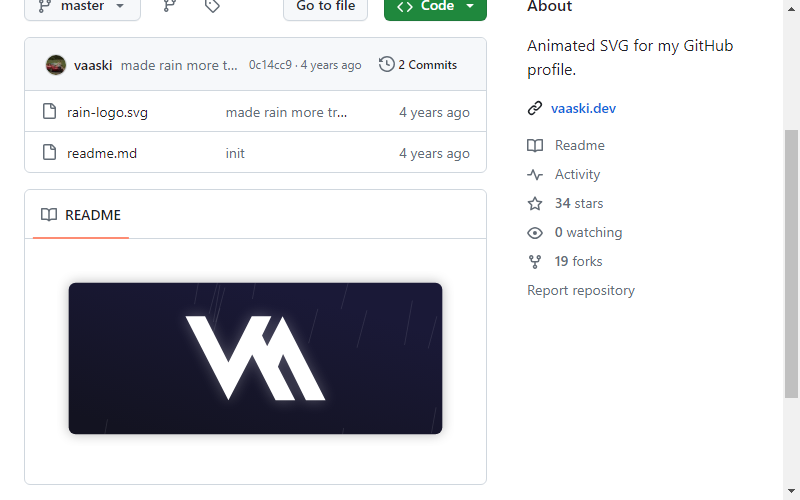
    </a>

??? example "[Arturs Smirnovs](https://github.com/arturssmirnovs/arturssmirnovs#readme) "
    

??? example "[Yash Sahijwani](https://github.com/Terabyte17/Terabyte17#readme) "
    

??? example "[Hemanth Kollipara](https://github.com/Defcon27/Defcon27#readme) "
    

??? example "[Tushar Mittal](https://github.com/techytushar/techytushar#readme) "
    

??? example "[Onimur](https://github.com/onimur/onimur#readme) "
    

??? example "[Bruno Tacca](https://github.com/brunotacca/brunotacca#readme) "
    

??? example "[Matthew Taylor](https://github.com/Wrapperup/Wrapperup#readme) "
    

## Typing.. Mode 🎰

??? example "[CyrisXD](https://github.com/CyrisXD/CyrisXD#readme) "
    

??? example "[Mpho Mphego](https://github.com/mmphego/mmphego#readme) "
    

??? example "[Abhinav Sharma](https://github.com/ABSphreak/ABSphreak#readme) "
    

??? example "[Mason Slover](https://github.com/MasonSlover/MasonSlover#readme) "
    

??? example "[SuperSupeng](https://github.com/SuperSupeng/SuperSupeng#readme) "
    

## Anime 👾

??? example "[edisonlee55](https://github.com/edisonlee55/edisonlee55#readme) "
    

??? example "[Ashutosh](https://github.com/Xx-Ashutosh-xX/Xx-Ashutosh-xX#readme) "
    

??? example "[Yukii](https://github.com/PrincessAkira/PrincessAkira#readme) "
    

## Minimalistic ✨

??? example "[Gift Egwuenu](https://github.com/lauragift21/lauragift21#readme) "
    

??? example "[Kelechi Precious Nwachukwu](https://github.com/PluckyPrecious/PluckyPrecious#readme) "
    

??? example "[Ghazi Khan](https://github.com/gkhan205#readme) "
    

??? example "[Pratik Kumar](https://github.com/pr2tik1/pr2tik1#readme) "
    

??? example "[Dennis Hartrampf](https://github.com/DennisHartrampf/DennisHartrampf#readme) "
    

??? example "[MrStanDu33](https://github.com/MrStanDu33/MrStanDu33#readme) "
    

??? example "[Jayraj Roshan](https://github.com/jayrajroshan/jayrajroshan#readme) "
    

??? example "[amxchang](https://github.com/amxchang/amxchang#readme) "
    

??? example "[ridermansb](https://github.com/Ridermansb/Ridermansb#readme) "
    

??? example "[Maximous Black](https://github.com/maximousblk/maximousblk#readme) "
    

??? example "[Alex Martin](https://github.com/AlexMartinFR/AlexMartinFR#readme) "
    <a href="https://github.com/AlexMartinFR/AlexMartinFR#readme">
    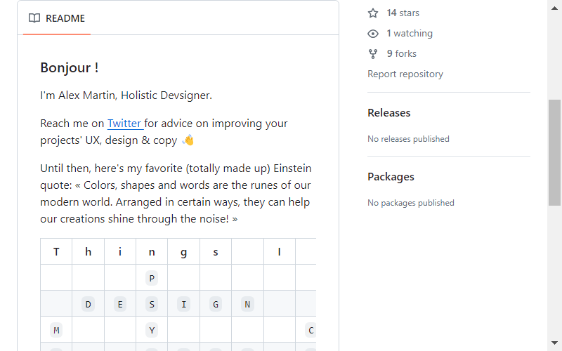
    </a>

??? example "[ChungZH](https://github.com/ChungZH/ChungZH/#readme) "
    

??? example "[Orhun](https://github.com/orhun/orhun#readme) "
    

??? example "[Aveek Saha](https://github.com/Aveek-Saha/Aveek-Saha#readme) "
    

??? example "[Federico Dondi](https://github.com/federico-dondi#readme) "
    

??? example "[Zheeeng](https://github.com/Zheeeng/Zheeeng#readme) "
    

??? example "[TallGuyJenks](https://github.com/tallguyjenks/tallguyjenks#readme) "
    

??? example "[Stefanie Grunwald](https://github.com/moertel/moertel#readme) "
    

??? example "[Abdul Khaliq](https://github.com/kha7iq/kha7iq#readme) "
    

## GIFS 👻

??? example "[Ari](https://github.com/ari-hacks/ari-hacks#readme) "
    

??? example "[Siv Ram Shastri](https://github.com/Prince-Shivaram/Prince-Shivaram#readme) "
    

??? example "[Shanu Mishra](https://github.com/Shanu1515/Shanu1515#readme) "
    

??? example "[Shubham Kumar](https://github.com/imskr/imskr#readme) "
    

??? example "[Duncan](https://github.com/dephraiim/dephraiim#readme) "
    

??? example "[Demartini](https://github.com/demartini/demartini#readme) "
    

??? example "[Sindre Sorhus](https://github.com/sindresorhus/sindresorhus#readme) "
    

??? example "[Pranjal Bhardwaj](https://github.com/Bhard27/Bhard27#readme) "
    

??? example "[Okan Koçyiğit](https://github.com/okankocyigit/okankocyigit#readme) "
    

??? example "[Raghav Khullar](https://github.com/RaghavK16/RaghavK16#readme) "
    

??? example "[xrkffgg](https://github.com/xrkffgg/xrkffgg#readme) "
    

??? example "[Kevin Cui](https://github.com/KevCui/KevCui#readme) "
    

??? example "[Muskan Rani](https://github.com/muskanrani/muskanrani#readme) "
    

??? example "[Rishav Anand](https://github.com/rishavanand/rishavanand#readme) "
    

??? example "[KelviNosse](https://github.com/KelviNosse/KelviNosse#readme) "
    

??? example "[nilfalse](https://github.com/nilfalse/nilfalse#readme) "
    

??? example "[Shahriar Shafin](https://github.com/ShahriarShafin/ShahriarShafin#readme) "
    

??? example "[Somnath Paul](https://github.com/SP-XD/SP-XD#readme) "
    

??? example "[Ksenia Morozova](https://github.com/kmoroz/kmoroz#readme) "
    

## Just Images 🎭

??? example "[偏右](https://github.com/afc163/afc163#readme) "
    

??? example "[thewhiteh4t](https://github.com/thewhiteh4t/thewhiteh4t#readme) "
    

??? example "[Akash Rai](https://github.com/akasrai/akasrai#readme) "
    

??? example "[Oussama Bouchikhi](https://github.com/oussamabouchikhi/oussamabouchikhi#readme) "
    

??? example "[Daily Random Photo](https://github.com/dailyrandomphoto/dailyrandomphoto#readme) "
    

## Badges 🎫

??? example "[Anirudh Emmadi](https://github.com/aemmadi/aemmadi#readme) "
    

??? example "[Brendon Smith](https://github.com/br3ndonland/br3ndonland#readme) "
    

??? example "[Alwin Wang](https://github.com/alwinw/alwinw#readme) "
    

??? example "[Moshfiq Rony](https://github.com/moshfiqrony/moshfiqrony#readme) "
    

??? example "[Ileriayo Adebiyi](https://github.com/ileriayo/ileriayo#readme) "
    

??? example "[Samujjwaal Dey](https://github.com/samujjwaal/samujjwaal#readme) "
    

??? example "[Char-Al](https://github.com/char-al/char-al#readme) "
    

??? example "[Oka](https://github.com/Coordinate-Cat/Coordinate-Cat#readme) "
    

??? example "[Nikita Rusetskii](https://github.com/xtenzQ/xtenzQ#readme) "
    

??? example "[Raphael Ebner](https://github.com/rafi0101/rafi0101#readme) "
    

## Fancy Fonts 🖋

## Icons 🎯

??? example "[Hussainweb](https://github.com/hussainweb/hussainweb#readme) "
    

??? example "[Peter Han](https://github.com/peterthehan/peterthehan#readme) "
    

??? example "[Thomas George Thomas](https://github.com/Thomas-George-T/Thomas-George-T#readme) "
    

??? example "[Derek Nguyen](https://github.com/dereknguyen269/dereknguyen269#readme) "
    

??? example "[Valentin Briand](https://github.com/vbriand/vbriand#readme) "
    

## Retro 😎

??? example "[Christian Petersen](https://github.com/fnky/fnky#readme) "
    

??? example "[Todoist Stats in Readme](https://github.com/abhisheknaiidu/todoist-readme#readme) "
    

??? example "[Visitor Badge](https://visitor-badge.glitch.me/#docs#readme) "
    

??? example "[1990s style Visitor Counter](https://twitter.com/ryanlanciaux/status/1283755637126705152#readme) "
    <a href="https://twitter.com/ryanlanciaux/status/1283755637126705152#readme">
    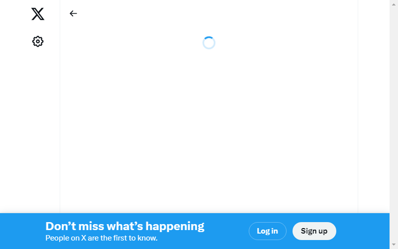
    </a>

??? example "[Vistor Count](https://pufler.dev/git-badges/#readme) "
    

??? example "[Shields Project](https://shields.io/#readme) "
    

??? example "[Github Readme Stats](https://github.com/anuraghazra/github-readme-stats#readme) "
    <a href="https://github.com/anuraghazra/github-readme-stats#readme">
    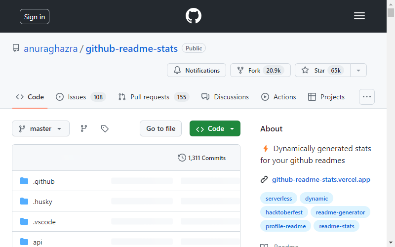
    </a>

??? example "[Github Contributor Stats](https://github.com/HwangTaehyun/github-contributor-stats#readme) "
    <a href="https://github.com/HwangTaehyun/github-contributor-stats#readme">
    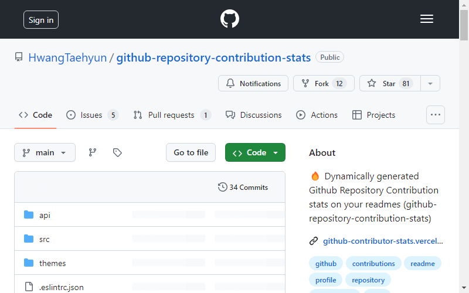
    </a>

??? example "[GitHub Streak Stats](https://github.com/DenverCoder1/github-readme-streak-stats#readme) "
    <a href="https://github.com/DenverCoder1/github-readme-streak-stats#readme">
    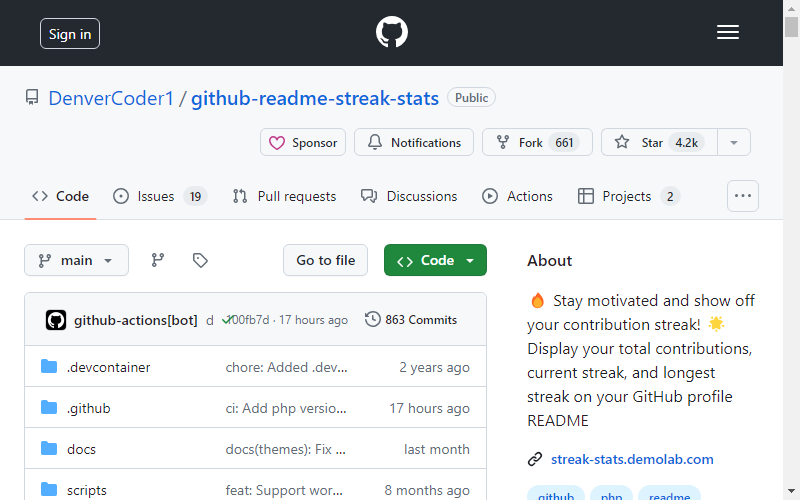
    </a>

??? example "[Simple Icons](https://github.com/simple-icons/simple-icons#cdn-usage#readme) "
    

??? example "[Laravel GitHub Profile Visit Counter](https://github.com/caneco/laravel-github-profile-view-counter#readme) "
    

??? example "[Dev Metrics in Readme](https://github.com/athul/waka-readme#readme) "
    <a href="https://github.com/athul/waka-readme#readme">
    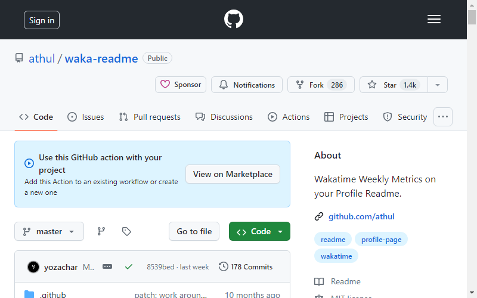
    </a>

??? example "[Profile Activity Generator](https://github.com/omidnikrah/profile-activity-generator#readme) "
    

??? example "[Current UTC time](https://github.com/jojoee/jojoee#readme) "
    <a href="https://github.com/jojoee/jojoee#readme">
    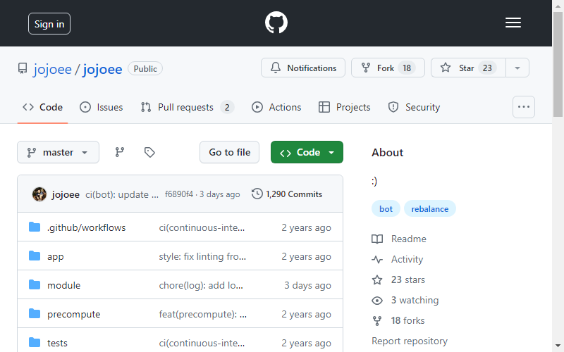
    </a>

??? example "[Github Activity in README](https://github.com/jamesgeorge007/github-activity-readme#readme) "
    <a href="https://github.com/jamesgeorge007/github-activity-readme#readme">
    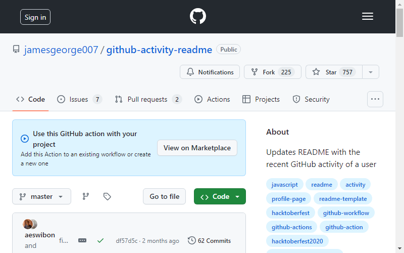
    </a>

??? example "[Github Profile README Generator](https://github.com/rahuldkjain/github-profile-readme-generator#readme) "
    

??? example "[Dynamic Profile Page On Github](https://github.com/umutphp/github-action-dynamic-profile-page#readme) "
    

??? example "[npm package downloads](https://github.com/maddhruv/github-readme-npm-downloads#readme) "
    

??? example "[All Dev Stats in Readme](https://github.com/anmol098/waka-readme-stats#readme) "
    <a href="https://github.com/anmol098/waka-readme-stats#readme">
    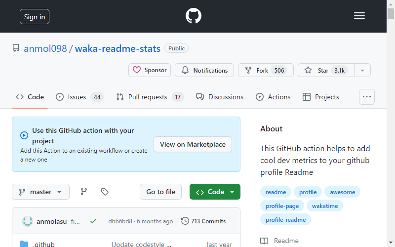
    </a>

??? example "[Feedparser](https://pythonhosted.org/feedparser/#readme) "
    <a href="https://pythonhosted.org/feedparser/#readme">
    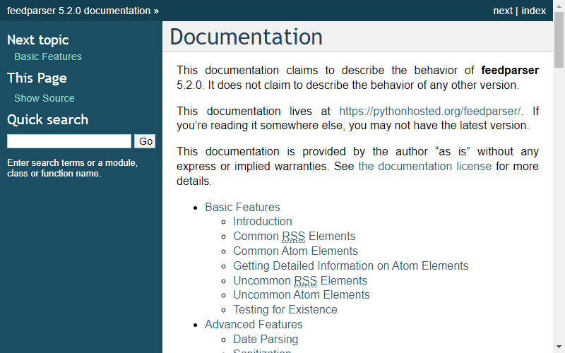
    </a>

??? example "[Profile README Widgets](https://github.com/marketplace/actions/profile-readme#readme) "
    

??? example "[Spotify now playing card generator](https://github.com/kittinan/spotify-github-profile#readme) "
    <a href="https://github.com/kittinan/spotify-github-profile#readme">
    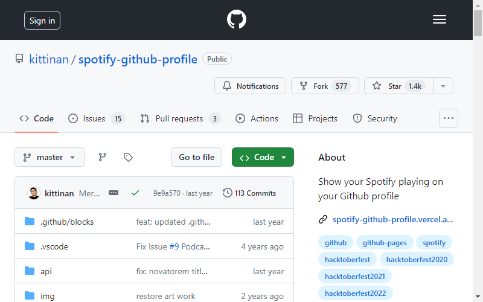
    </a>

??? example "[Markdown Badges](https://github.com/Ileriayo/markdown-badges#readme) "
    

??? example "[Latest Blog Posts and StackOverflow activity in readme](https://github.com/gautamkrishnar/blog-post-workflow#readme) "
    

??? example "[GitHub Readme LinkedIn](https://github.com/soroushchehresa/github-readme-linkedin#readme) "
    

??? example "[GitHub Readme Medium](https://github.com/omidnikrah/github-readme-medium#readme) "
    

??? example "[GitHub Readme StackOverflow](https://github.com/omidnikrah/github-readme-stackoverflow#readme) "
    <a href="https://github.com/omidnikrah/github-readme-stackoverflow#readme">
    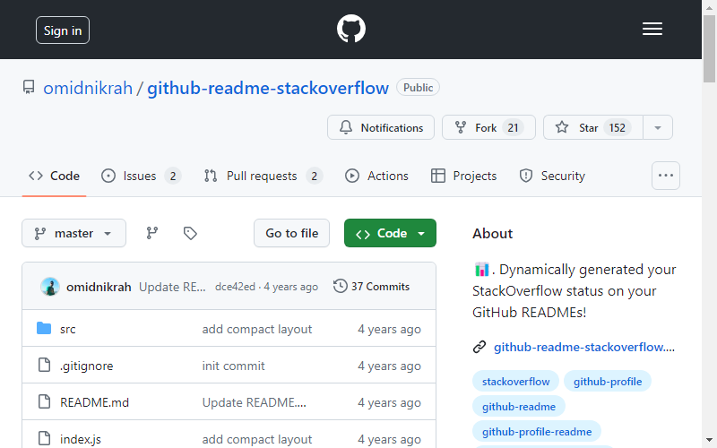
    </a>

??? example "[StackOverflow Stats Badge](https://github.com/claytonjhamilton/stackoverflow-badge#readme) "
    

??? example "[Github Profile README Generator](https://github.com/arturssmirnovs/github-profile-readme-generator#readme) "
    

??? example "[Profile Readme Stats](https://github.com/marketplace/actions/profile-readme-stats#readme) "
    

??? example "[README Jokes](https://github.com/ABSphreak/readme-jokes#readme) "
    

??? example "[GitHub Profile Trophy](https://github.com/ryo-ma/github-profile-trophy#readme) "
    

??? example "[Github Readme Twitter](https://github.com/gazf/github-readme-twitter#readme) "
    

??? example "[Random Dev Memes](https://github.com/techytushar/random-memer#readme) "
    <a href="https://github.com/techytushar/random-memer#readme">
    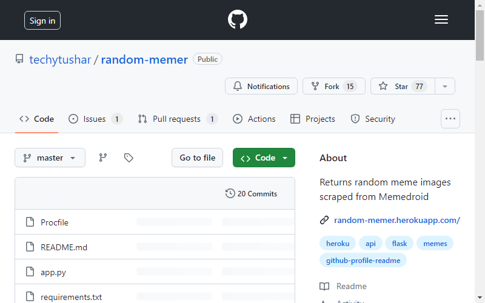
    </a>

??? example "[GitHub Readme Quotes](https://github.com/PiyushSuthar/github-readme-quotes#readme) "
    

??? example "[GitHub Profilinator](https://github.com/rishavanand/github-profilinator#readme) "
    <a href="https://github.com/rishavanand/github-profilinator#readme">
    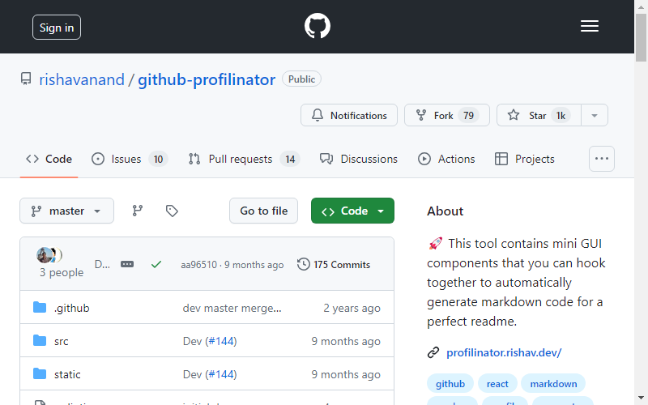
    </a>

??? example "[PageSpeed score](https://github.com/ankurparihar/readme-pagespeed-insights#readme) "
    <a href="https://github.com/ankurparihar/readme-pagespeed-insights#readme">
    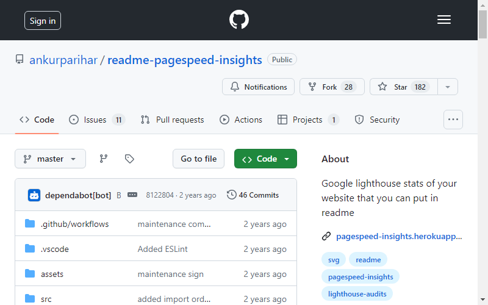
    </a>

??? example "[Gitwar Profile Score](https://github.com/iampavangandhi/Gitwar#readme) "
    <a href="https://github.com/iampavangandhi/Gitwar#readme">
    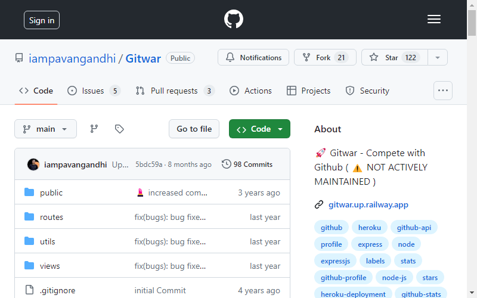
    </a>

??? example "[Header Images for Github Profile READMEs](https://github.com/khalby786/REHeader#readme) "
    

??? example "[YouTube Channel Stats](https://github.com/DenverCoder1/github-readme-youtube-stats#readme) "
    <a href="https://github.com/DenverCoder1/github-readme-youtube-stats#readme">
    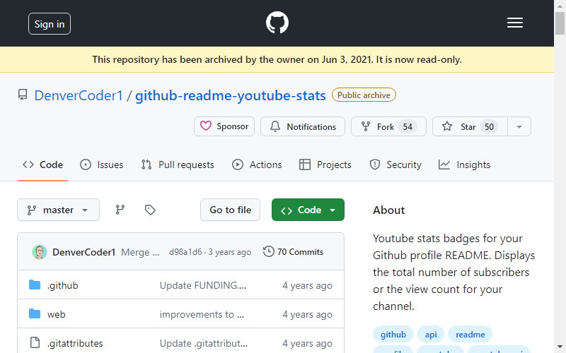
    </a>

??? example "[Current Book Status from GoodReads](https://github.com/theFr1nge/goodreads-readme#readme) "
    <a href="https://github.com/theFr1nge/goodreads-readme#readme">
    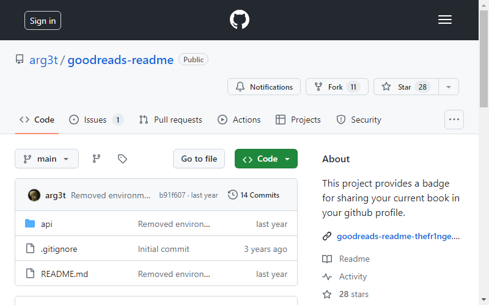
    </a>

??? example "[Readme Typing SVG](https://github.com/DenverCoder1/readme-typing-svg#readme) "
    <a href="https://github.com/DenverCoder1/readme-typing-svg#readme">
    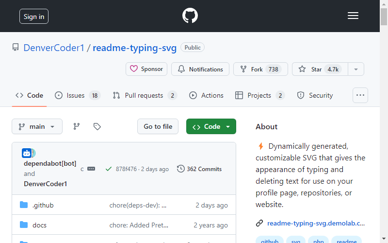
    </a>

??? example "["How To Create A GitHub Profile README"](https://www.aboutmonica.com/blog/how-to-create-a-github-profile-readme#readme) "
    

??? example "["How to Stand Out on Github with Profile READMEs"](https://medium.com/better-programming/how-to-stand-out-on-github-with-profile-readmes-dfd2102a3490?source=friends_link&sk=61df9c4b63b329ad95528b8d7c00061f#readme) "
    

??? example "["What's on your GitHub Profile"](https://dev.to/waylonwalker/what-s-on-your-github-profile-40p3#readme) "
    

??? example "["3 Ways to Spice up your Github Profile README 🔥"](https://dev.to/jayehernandez/3-ways-to-spice-up-your-github-profile-readme-1276#readme) "
    

??? example "["Dynamically Generated Github Stats For Your Profile ReadMe"](https://dev.to/anuraghazra/dynamically-generated-github-stats-for-your-profile-readme-o4g#readme) "
    

??? example "["How to create an awesome GIF for your GitHub Profile README"](https://dev.to/satvikchachra/how-to-add-an-awesome-readme-to-your-github-profile-361n#readme) "
    

??? example "["Create a special repository in your GitHub Profile 🔨, supported and unsupported features"](https://torrocus.com/blog/special-github-repository/#readme) "
    

??? example "["How to create a Github Profile README with Dynamic Github Stats"](https://codewithghazi.com/how-to-create-a-github-profile-readme-with-dynamic-github-stats/#readme) "
    

??? example "["How I Built A Self-Updating README On My Github Profile"](https://www.mokkapps.de/blog/how-i-built-a-self-updating-readme-on-my-git-hub-profile/#readme) "
    

??? example "["Building a self-updating profile README for GitHub"](https://simonwillison.net/2020/Jul/10/self-updating-profile-readme/#readme) "
    

??? example "["How to create an interactive README for your GitHub profile"](https://kavishhukmani.me/github-profile-interactive-readme-tutorial/#readme) "
    

??? example "["什么？Github 居然可以这么玩？"](https://zhuanlan.zhihu.com/p/161705999#readme) "
    

??? example "["Getting started with Markdown Badges"](https://dev.to/ileriayo/mardown-badges-2og0#readme) "
    

??? example "["Show your latest dev.to posts automatically on your GitHub profile readme"](https://dev.to/gautamkrishnar/show-your-latest-dev-to-posts-automatically-in-your-github-profile-readme-3nk8#readme) "
    

??? example "["How I Built A Self-Updating README by Webhooks and Netlify Functions"](https://github.com/RaoHai/RaoHai/blob/master/How-I-Built-A-Self-Updating-README-by-Webhooks-and-Netlify-Functions.md/#readme) "
    

??? example "["Build a Stunning README For Your GitHub Profile"](https://towardsdatascience.com/build-a-stunning-readme-for-your-github-profile-9b80434fe5d7#readme) "
    

??? example "["How I added my Spotify statistics to my GitHub readme 📜"](https://dev.to/gargakshit/how-i-added-my-spotify-statistics-to-my-github-readme-4jdd#readme) "
    

??? example "["Static Readme Regeneration"](https://dev.to/aralroca/static-readme-regeneration-4pf2#readme) "
    

??? example "["How to Create a Self-Updating README.md for Your GitHub Profile"](https://medium.com/@th.guibert/how-to-create-a-self-updating-readme-md-for-your-github-profile-f8b05744ca91#readme) "
    <a href="https://medium.com/@th.guibert/how-to-create-a-self-updating-readme-md-for-your-github-profile-f8b05744ca91#readme">
    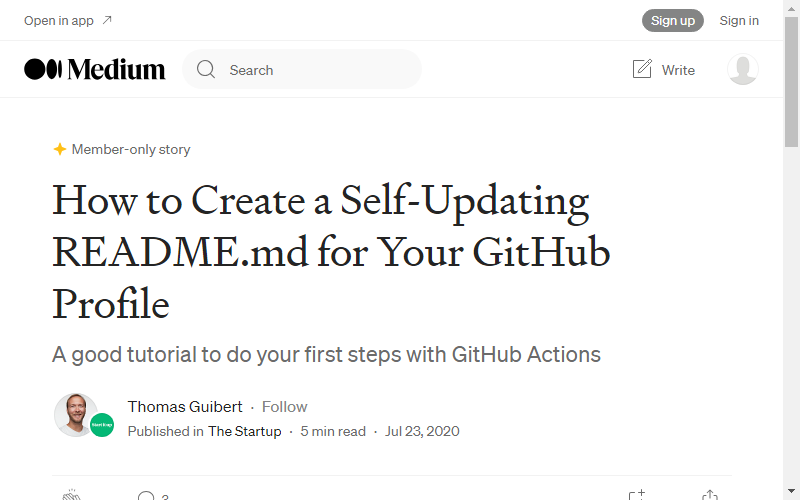
    </a>

??? example "["一文玩转github主页"](https://blog.holic-x.com/wv-blog/post/7ad96a5d.html#readme) "
    

??? example "["Create Impressive GitHub Portfolio"](https://www.youtube.com/watch?v=dkE4mVhwMB4#readme) "
    

??? example "["How To Create a Github Profile ReadMe"](https://www.youtube.com/watch?v=DOiGs2NiDbU#readme) "
    

??? example "["How to create a GitHub profile README"](https://www.youtube.com/watch?v=vND_UY7xk24#readme) "
    

??? example "["How To Create A GitHub Profile README"](https://www.youtube.com/watch?v=Y1z7_GfEPiE#readme) "
    

??? example "["Next Level GitHub Profile README"](https://youtu.be/ECuqb5Tv9qI#readme) "
    

??? example "[Zetao Zhuang](https://github.com/zzetao#readme) "
    

