---
hide:
  - navigation
  - toc
---

# Tools

??? example "[Visitor Badge](https://visitor-badge.glitch.me/#docs)  Count visitors for your README.md, Issues, PRs in GitHub"
    <a href="https://visitor-badge.glitch.me/#docs">
    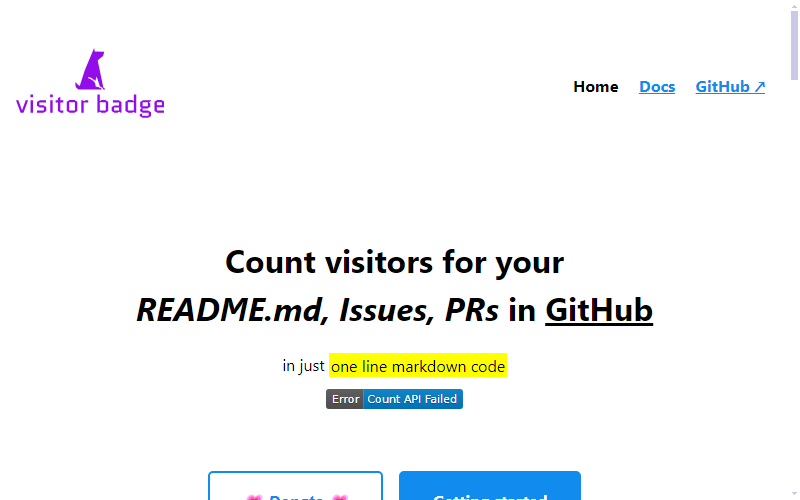
    </a>

??? example "[1990s style Visitor Counter](https://twitter.com/ryanlanciaux/status/1283755637126705152)  Add a 1990s style visitor counter with one line of markdown."
    <a href="https://twitter.com/ryanlanciaux/status/1283755637126705152">
    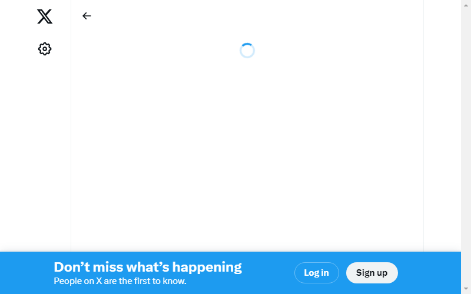
    </a>

??? example "[Vistor Count](https://pufler.dev/git-badges/)  Count visitors for README.md that can be used with shields.io"
    <a href="https://pufler.dev/git-badges/">
    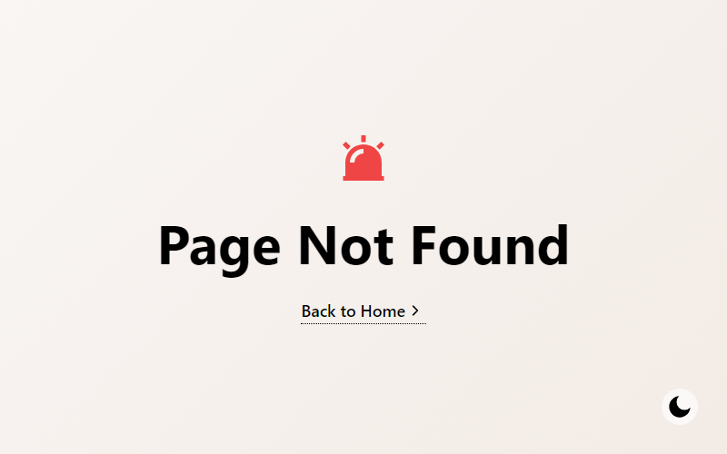
    </a>

??? example "[Shields Project](https://shields.io/)  Use Shields to create profile badges, compatible with Simple Icons"
    <a href="https://shields.io/">
    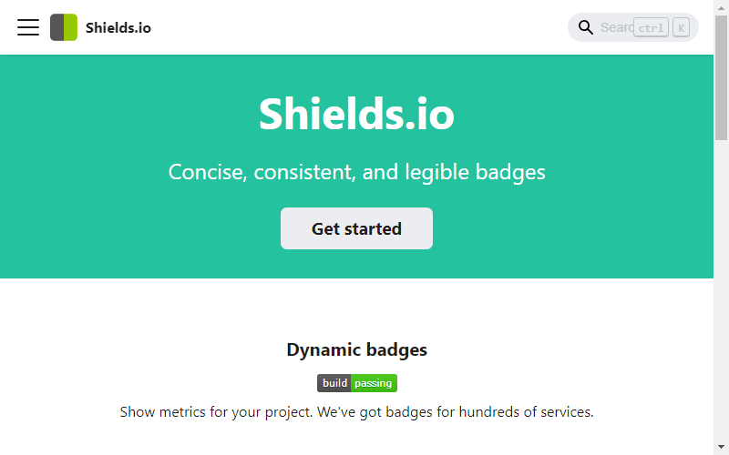
    </a>

??? example "[Github Readme Stats](https://github.com/anuraghazra/github-readme-stats)  Get dynamically generated GitHub stats on your readmes"
    <a href="https://github.com/anuraghazra/github-readme-stats">
    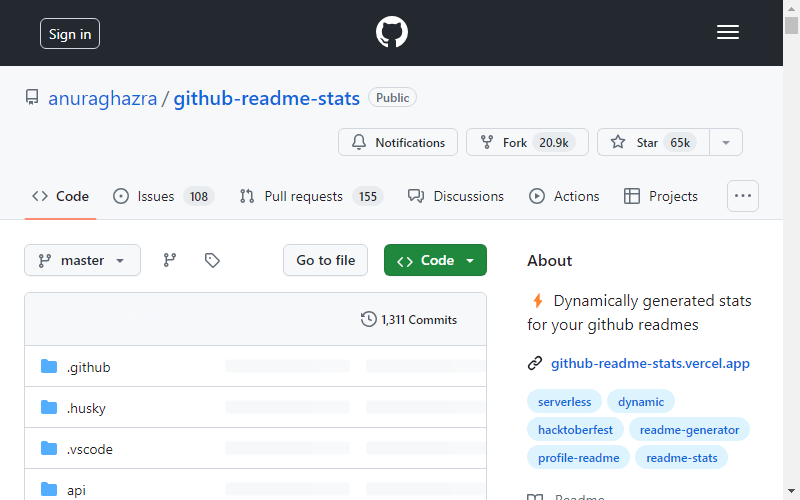
    </a>

??? example "[Github Contributor Stats](https://github.com/HwangTaehyun/github-contributor-stats)  :fire: Get dynamically generated Github Contributor stats (repositories you really committed) on your readmes"
    <a href="https://github.com/HwangTaehyun/github-contributor-stats">
    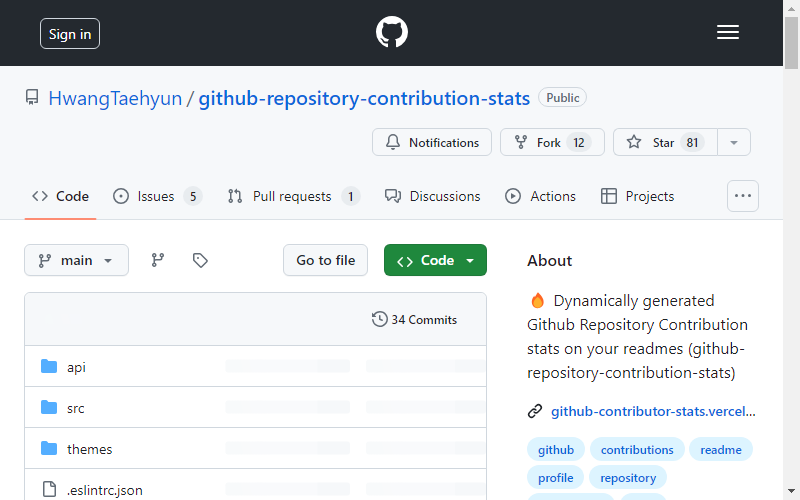
    </a>

??? example "[GitHub Streak Stats](https://github.com/DenverCoder1/github-readme-streak-stats)  🔥 Stay motivated and show off your contribution streak! 🌟 Display your total contributions, current streak, and longest streak on your GitHub profile README"
    <a href="https://github.com/DenverCoder1/github-readme-streak-stats">
    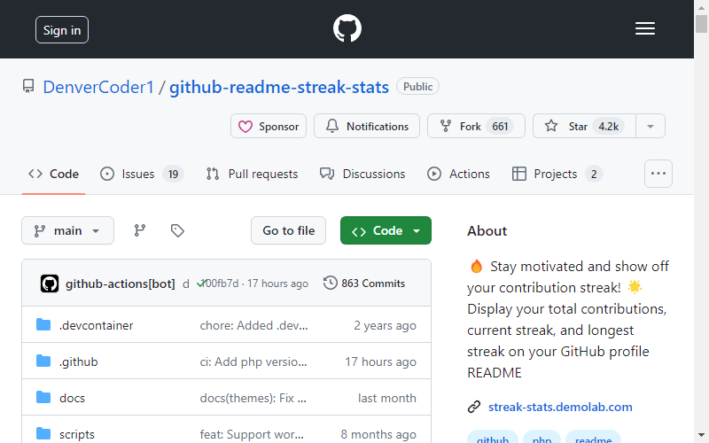
    </a>

??? example "[Simple Icons](https://github.com/simple-icons/simple-icons#cdn-usage)  SVG icons for popular brands for your README.md files"
    <a href="https://github.com/simple-icons/simple-icons#cdn-usage">
    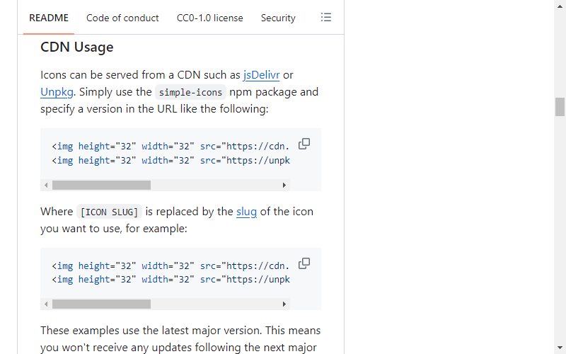
    </a>

??? example "[Laravel GitHub Profile Visit Counter](https://github.com/caneco/laravel-github-profile-view-counter)  Add on your Laravel project a quick-badge to count your profile visits."
    <a href="https://github.com/caneco/laravel-github-profile-view-counter">
    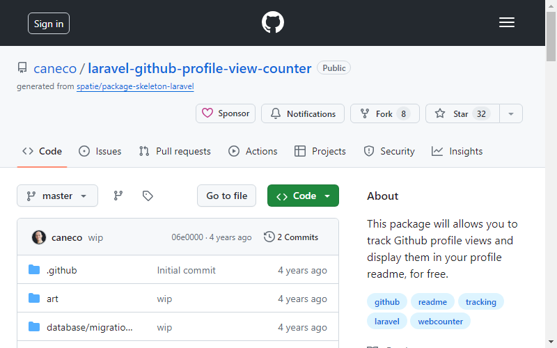
    </a>

??? example "[Dev Metrics in Readme](https://github.com/athul/waka-readme)  [WakaTime](https://wakatime.com/) Weekly Metrics on your Profile Readme"
    <a href="https://github.com/athul/waka-readme">
    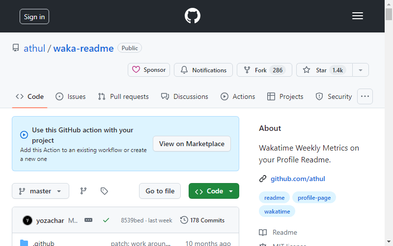
    </a>

??? example "[Profile Activity Generator](https://github.com/omidnikrah/profile-activity-generator)  Generate custom profile activity for your profile README"
    <a href="https://github.com/omidnikrah/profile-activity-generator">
    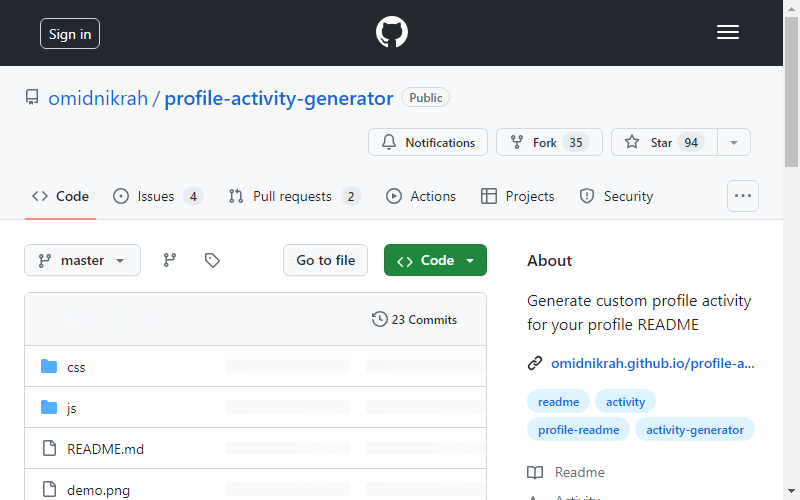
    </a>

??? example "[Current UTC time](https://github.com/jojoee/jojoee)  Example code of server that can serve dynamic content on GitHub profile"
    <a href="https://github.com/jojoee/jojoee">
    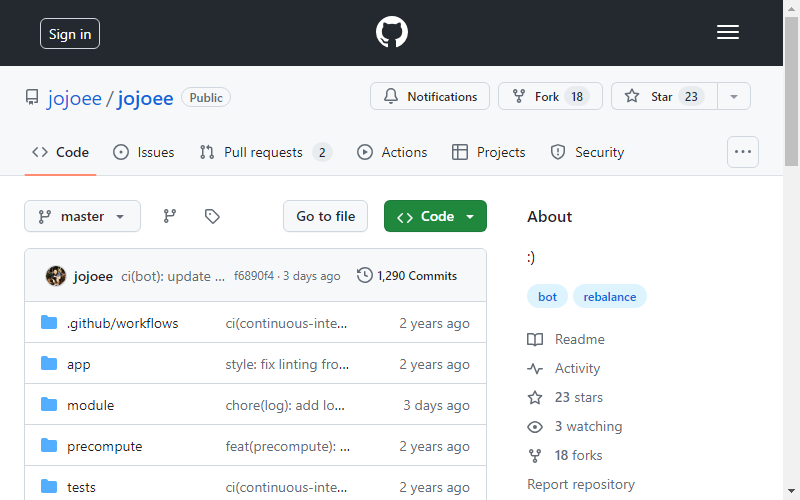
    </a>

??? example "[Github Activity in README](https://github.com/jamesgeorge007/github-activity-readme)  Updates `README.md` with the recent GitHub activity of a user"
    <a href="https://github.com/jamesgeorge007/github-activity-readme">
    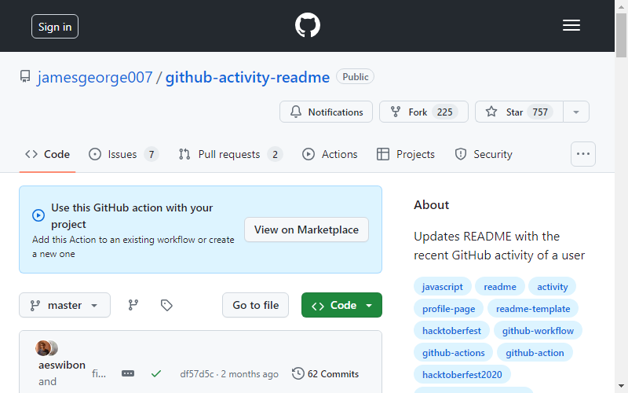
    </a>

??? example "[Github Profile README Generator](https://github.com/rahuldkjain/github-profile-readme-generator)  This tool provides an easy way to create github profile readme with latest addons like `visitors count`, `github stats` etc."
    <a href="https://github.com/rahuldkjain/github-profile-readme-generator">
    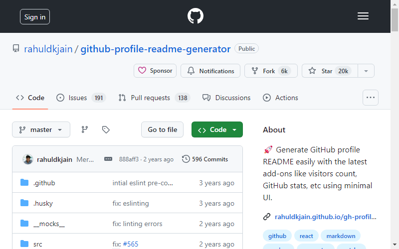
    </a>

??? example "[Dynamic Profile Page On Github](https://github.com/umutphp/github-action-dynamic-profile-page)  Get dynamically generated list of your commits (of the repositories that the action is configured) on GitHub profile readme."
    <a href="https://github.com/umutphp/github-action-dynamic-profile-page">
    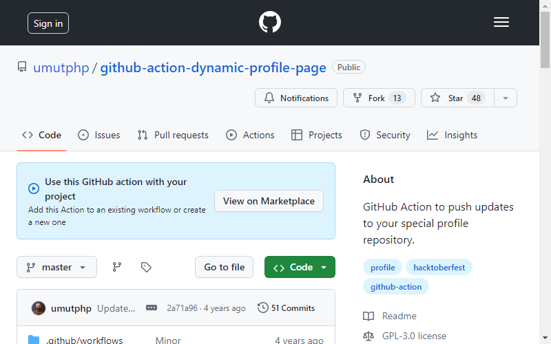
    </a>

??? example "[npm package downloads](https://github.com/maddhruv/github-readme-npm-downloads)  Show all of your npm packages and their total downloads"
    <a href="https://github.com/maddhruv/github-readme-npm-downloads">
    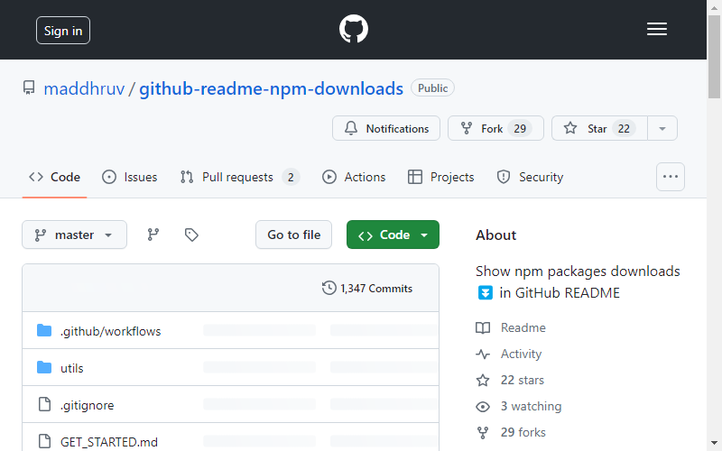
    </a>

??? example "[All Dev Stats in Readme](https://github.com/anmol098/waka-readme-stats)  Are you an early 🐤 or a night 🦉? When are you most productive during the day? What languages you code in? And other stuff... Let's check out in your readme!"
    <a href="https://github.com/anmol098/waka-readme-stats">
    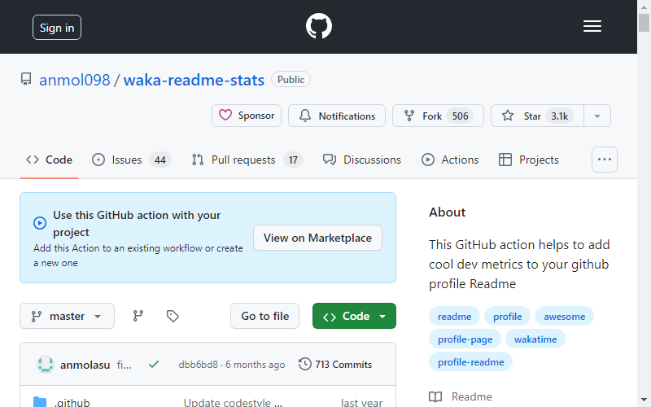
    </a>

??? example "[Feedparser](https://pythonhosted.org/feedparser/)  Convenient processing of RSS files"
    <a href="https://pythonhosted.org/feedparser/">
    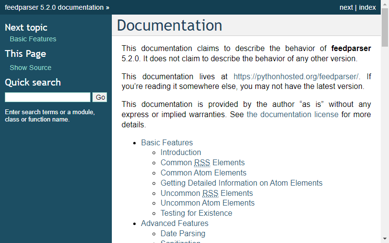
    </a>

??? example "[Profile README Widgets](https://github.com/marketplace/actions/profile-readme)  Add simple widgets to your profile readme."
    <a href="https://github.com/marketplace/actions/profile-readme">
    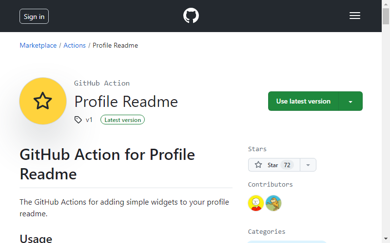
    </a>

??? example "[Spotify now playing card generator](https://github.com/kittinan/spotify-github-profile)  Generate your Spotify now playing card for your GitHub profile"
    <a href="https://github.com/kittinan/spotify-github-profile">
    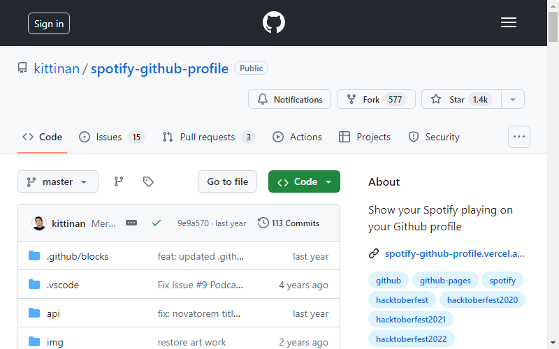
    </a>

??? example "[Markdown Badges](https://github.com/Ileriayo/markdown-badges)  Add badges to your profile."
    <a href="https://github.com/Ileriayo/markdown-badges">
    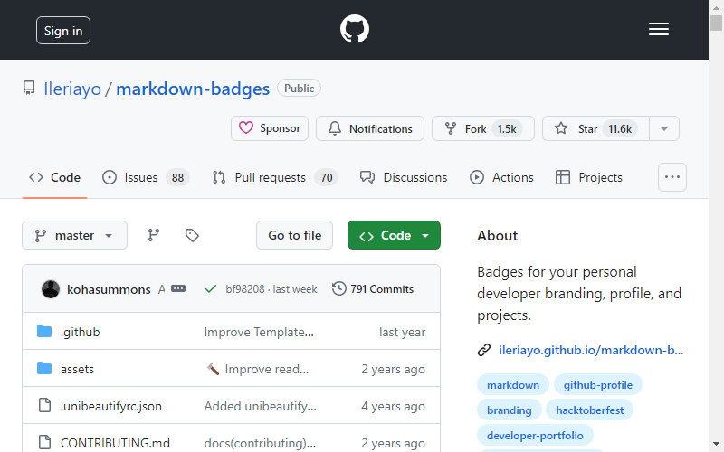
    </a>

??? example "[Latest Blog Posts and StackOverflow activity in readme](https://github.com/gautamkrishnar/blog-post-workflow)  Show your latest blog posts from any sources or StackOverflow activity on your GitHub profile/project readme automatically using the RSS feed using this Github Action"
    <a href="https://github.com/gautamkrishnar/blog-post-workflow">
    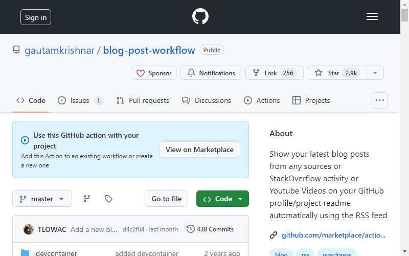
    </a>

??? example "[GitHub Readme LinkedIn](https://github.com/soroushchehresa/github-readme-linkedin)  Get dynamically generated images from your LinkedIn profile on your GitHub readmes"
    <a href="https://github.com/soroushchehresa/github-readme-linkedin">
    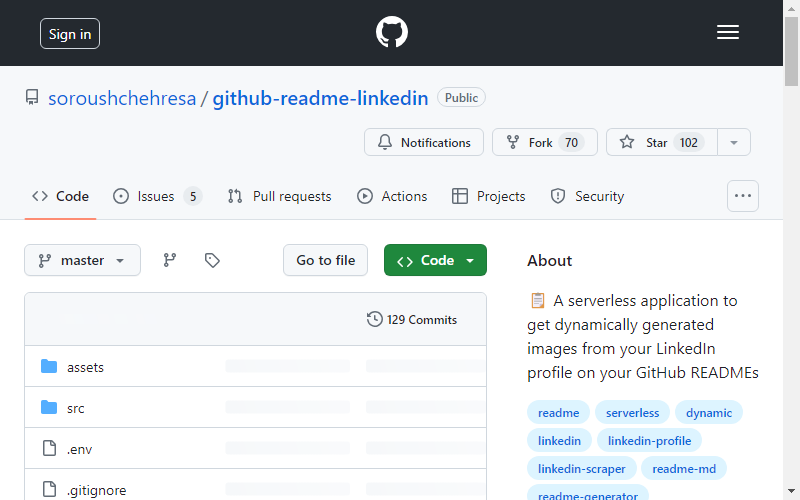
    </a>

??? example "[GitHub Readme Medium](https://github.com/omidnikrah/github-readme-medium)  Show your latest Medium article on your readmes!"
    <a href="https://github.com/omidnikrah/github-readme-medium">
    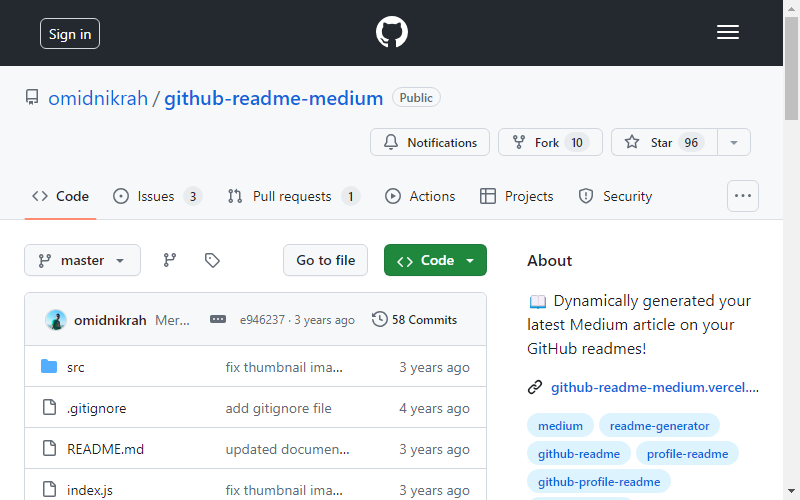
    </a>

??? example "[GitHub Readme StackOverflow](https://github.com/omidnikrah/github-readme-stackoverflow)  Dynamically generated your StackOverflow profile status on your GitHub readmes!"
    <a href="https://github.com/omidnikrah/github-readme-stackoverflow">
    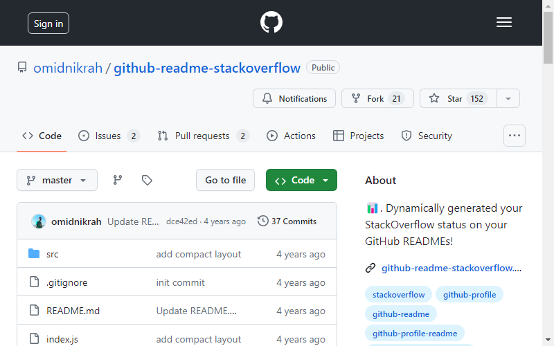
    </a>

??? example "[StackOverflow Stats Badge](https://github.com/claytonjhamilton/stackoverflow-badge)  Display your stats with this Unique StackOverflow Badge!"
    <a href="https://github.com/claytonjhamilton/stackoverflow-badge">
    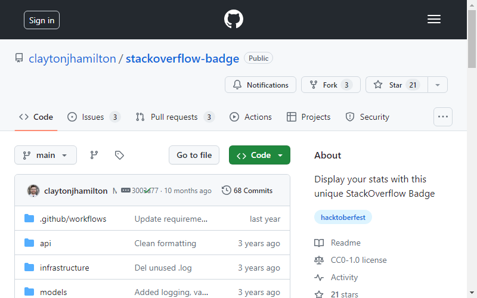
    </a>

??? example "[Github Profile README Generator](https://github.com/arturssmirnovs/github-profile-readme-generator)  This project allows you to create nice and simple github profile readme files."
    

??? example "[Profile Readme Stats](https://github.com/marketplace/actions/profile-readme-stats)  [Github Action] Showcase your github stats on your profile README.md"
    <a href="https://github.com/marketplace/actions/profile-readme-stats">
    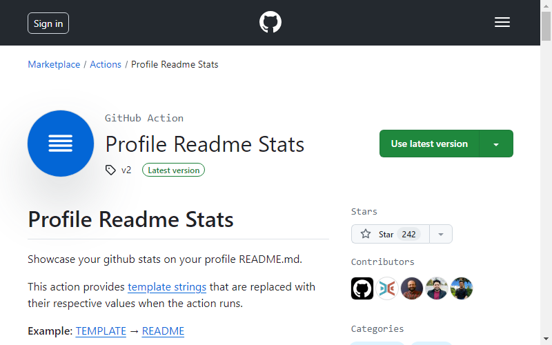
    </a>

??? example "[README Jokes](https://github.com/ABSphreak/readme-jokes)  Random dev jokes in your GitHub README."
    <a href="https://github.com/ABSphreak/readme-jokes">
    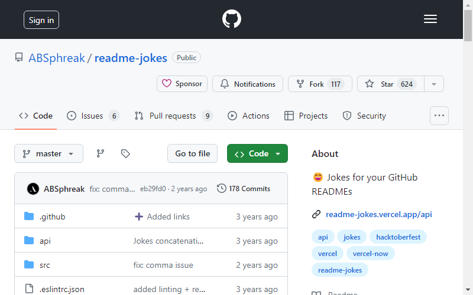
    </a>

??? example "[GitHub Profile Trophy](https://github.com/ryo-ma/github-profile-trophy)  🏆 Add dynamically generated GitHub Trophy on your readme"
    <a href="https://github.com/ryo-ma/github-profile-trophy">
    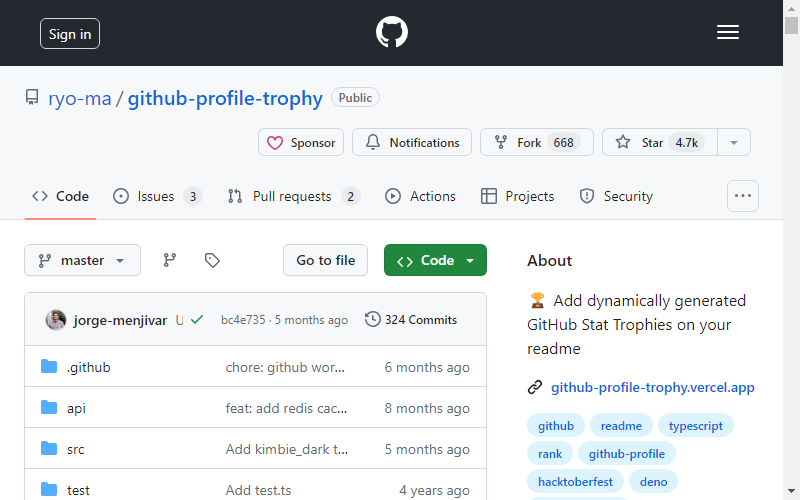
    </a>

??? example "[Github Readme Twitter](https://github.com/gazf/github-readme-twitter)  Show your latest tweet on your readmes."
    <a href="https://github.com/gazf/github-readme-twitter">
    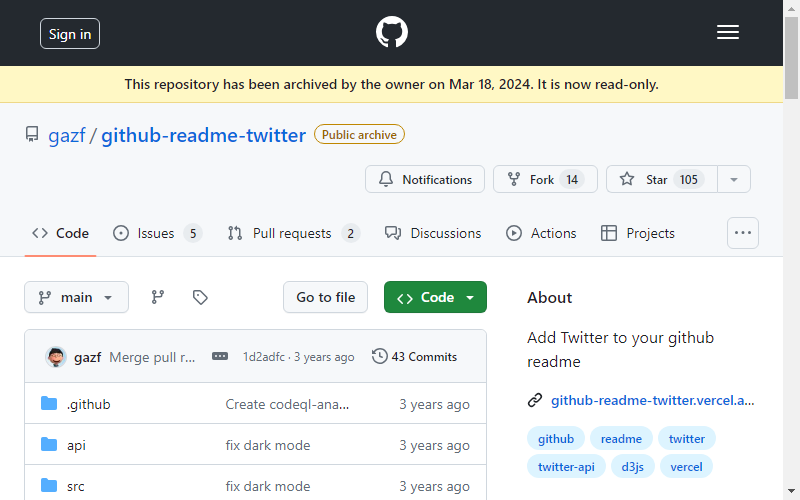
    </a>

??? example "[Random Dev Memes](https://github.com/techytushar/random-memer)  Random dev memes to display on your GitHub README."
    <a href="https://github.com/techytushar/random-memer">
    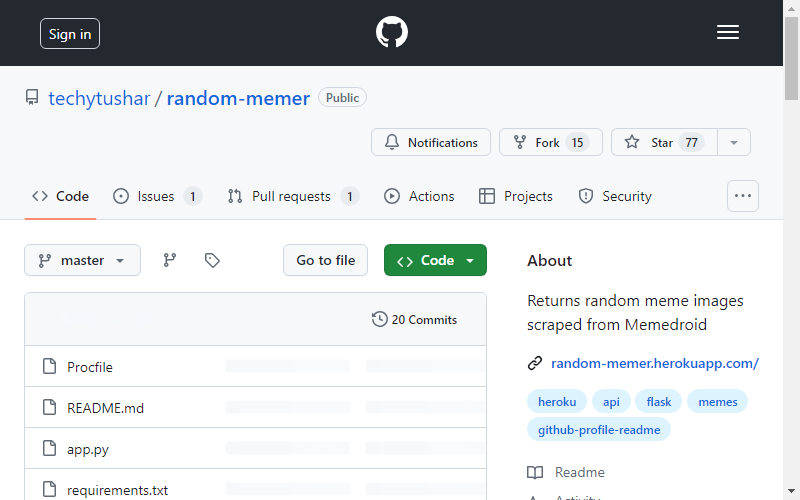
    </a>

??? example "[GitHub Readme Quotes](https://github.com/PiyushSuthar/github-readme-quotes)  Dev quotes on your GitHub Profile Readme."
    <a href="https://github.com/PiyushSuthar/github-readme-quotes">
    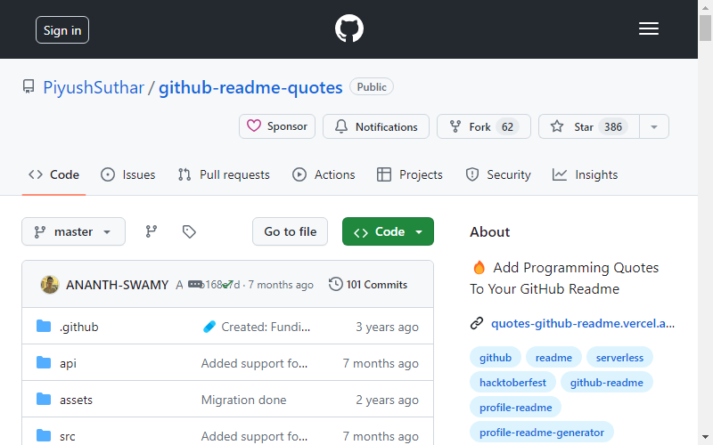
    </a>

??? example "[GitHub Profilinator](https://github.com/rishavanand/github-profilinator)  This tool contains small GUI components that you can hook together to generate markdown for your perfect readme."
    <a href="https://github.com/rishavanand/github-profilinator">
    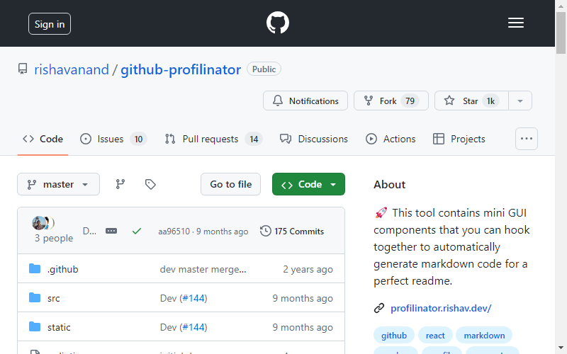
    </a>

??? example "[PageSpeed score](https://github.com/ankurparihar/readme-pagespeed-insights)  Generate website's PageSpeed score in animated svg form which can be used in GitHub README"
    <a href="https://github.com/ankurparihar/readme-pagespeed-insights">
    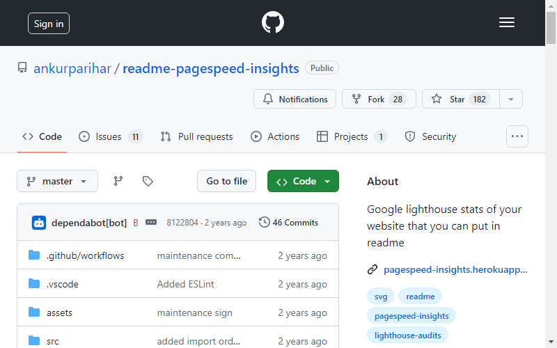
    </a>

??? example "[Gitwar Profile Score](https://github.com/iampavangandhi/Gitwar)  Add your Github Profile Score in README."
    <a href="https://github.com/iampavangandhi/Gitwar">
    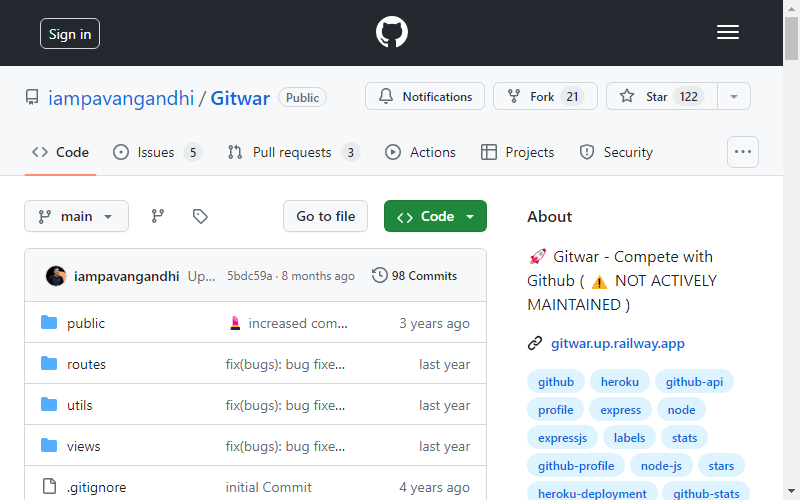
    </a>

??? example "[Header Images for Github Profile READMEs](https://github.com/khalby786/REHeader)  Generate header images for your GitHub profile READMEs with custom content"
    <a href="https://github.com/khalby786/REHeader">
    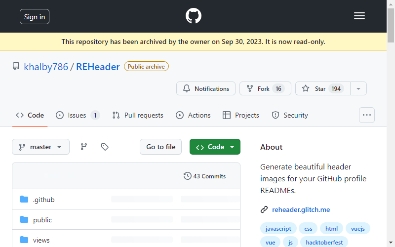
    </a>

??? example "[YouTube Channel Stats](https://github.com/DenverCoder1/github-readme-youtube-stats)  📺 Display number of subscribers on YouTube and/or your channel's view count as a badge"
    <a href="https://github.com/DenverCoder1/github-readme-youtube-stats">
    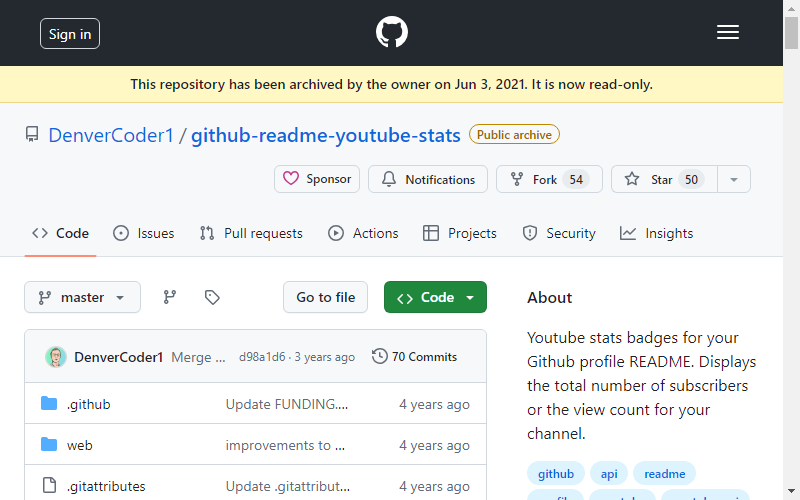
    </a>

??? example "[Current Book Status from GoodReads](https://github.com/theFr1nge/goodreads-readme)  Add a card of the current book you are reading that automatically syncs with GoodReads to display your progress."
    <a href="https://github.com/theFr1nge/goodreads-readme">
    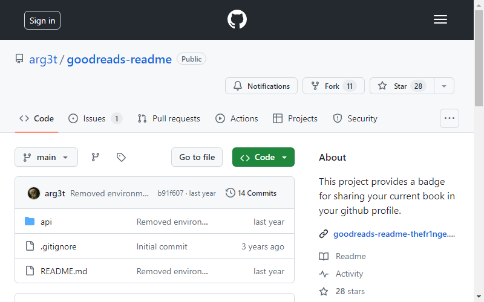
    </a>

??? example "[Readme Typing SVG](https://github.com/DenverCoder1/readme-typing-svg)  :zap: Dynamically generated, customizable SVG that gives the appearance of typing and deleting text"
    <a href="https://github.com/DenverCoder1/readme-typing-svg">
    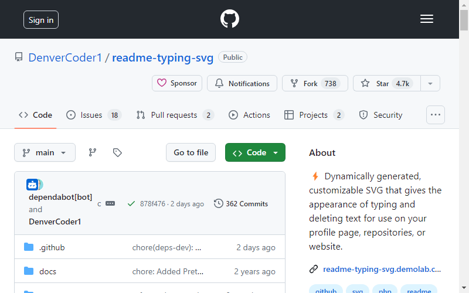
    </a>
